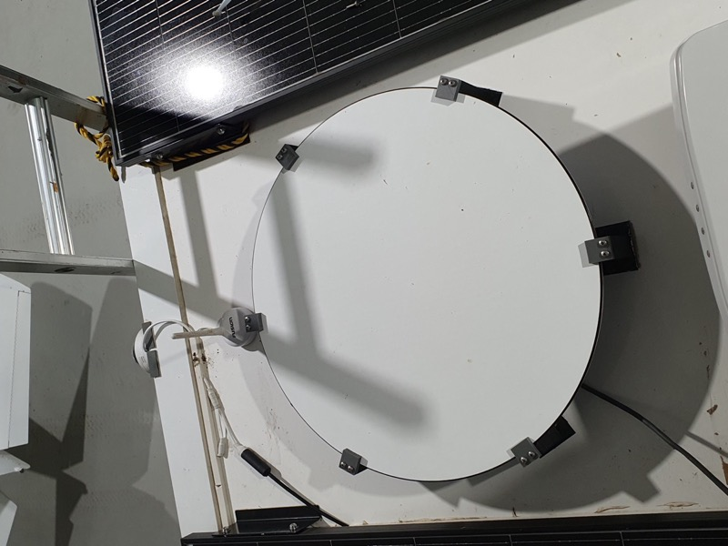

# A collection of RV-related project information

See the sub-directories for individual projects (click to go to any of the following.)

## [12V power for a Starlink dish](poe/README.md)

[How to use a DC-DC converter and POE injector to power a Starlink dish from 12V, and using a non-Starlink router.](poe/README.md)

## [Flat-mounting a round Starlink dish](round-dish-mounting/README.md)

[How to remove the motors and pole from a round Dishy and hard-mount it to an RV](round-dish-mounting/README.md)

## [Powering a Sony TV from 12V](tv-power/README.md)

[Get a proper smart TV in your RV by adapting a name-brand TV to run from 12V](tv-power/README.md)

