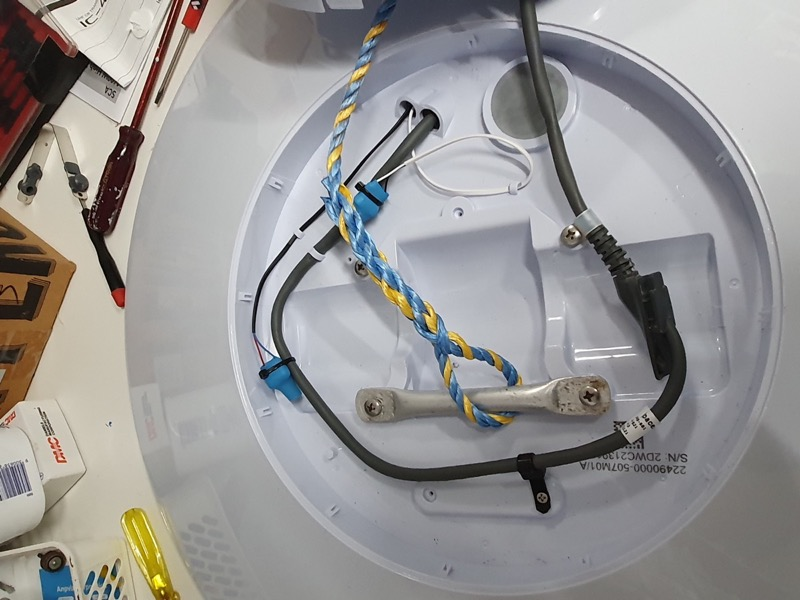
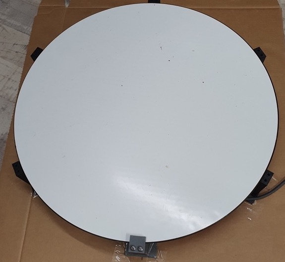

# Mounting a round Starlink Dishy to an RV in a fixed position
## (And general information on running Starlink from 12V)

## TL;DR

* Remove the pole and motor from your round Dishy
* 3D print 6 mounting blocks and a case closure
* Glue to the top of your RV
* Supply POE
* Enjoy Starlink anywhere with no setup.

## Why and What

Now that Starlink has an RV plan that allows roaming anywhere within their service area, use on an RV has become very
appealing. The standard Starlink dishes mount on a pole, and have inbuilt motors that point the dish in the most
favourable direction for the given location. This is inconvenient for RV use since it either requires demounting the
dish and storing it for travel, or some very clever arrangements. Also, while the pole is supposed to handle high winds,
it's not intended for use on top of a moving vehicle, even when the dish is not in use.

Also, the Starlink hardware runs only from 120-240VAC which is not ideal for use in an off-grid application where 12V is more readily available.

This repository documents the solution I adopted to this problem. Some important caveats:

1. This is a record of what I did and how I did it. It is not intended to be a "how-to", just a resource for use by
   those who might want to attempt something similar. I take no responsibility for anything anyone else might do with
   the information.
2. Starlink does not currently support use in motion and their terms of service state that doing so will void your
   warranty.
3. Modifying your dish will void your warranty.
4. Mounting anything on top of a vehicle should be done with great care - you do NOT want it to come off while
   travelling.
5. There are other risks that you should consider in doing anything non-standard with a Starlink dish.

## Background

I won't explain the Starlink system here - there are plenty of other resources for that. But a brief explanation of dish
pointing is in order.

The Starlink satellites communicate with the user terminal ("Dishy") at very high frequencies (17-40GHz) which allows
very tight beam formation. The dish has a phased array antenna that can electronically point in any direction within a
cone of about 90 degrees. For various reasons the dish will use its motors to point towards the nearest pole (so north
in the northern hemisphere) with an elevation (angle above the horizon) of 60 degrees or so (at high latitudes it may
point straight up or even toward the equator.) However, once this position is established the dish does not move, and
tracking of the satellites (which pass across the entire field of view in about 2 minutes) is entirely achieved by
electronically steering the beam using the phased array antenna.

The dish also incorporates an accelerometer and gyroscope that enables it to stabilise the beam if the dish is moving (
which is why Starlink says it is ok to be mounted on a tall pole or even in a tree.)

So, if the dish is unable to move itself it will still work. There may be some performance drawbacks (e.g. inability to
track a satellite at a low elevation) but the system is sufficiently fault-tolerant that it's not a big deal.

## Round vs rectangular dish

The Starlink dishes to date have come in three revisions;

1. Rev 1 was the first batch of round dishes, with black parts. These have higher power consumption and are possibly
   less reliable. You don't want one of those.
2. Rev 2 was the second batch of round dishes, distinguishable from Rev 1 by grey rather than black parts. They are not
   now available from Starlink but can be bought on the second hand market. I'll refer to this by the symbol ().
3. Rev 3 which is what is currently shipping is the rectangular dish, and will be referred to as [].

## Getting a dish

If you order a dish now from Starlink it will be a [], but () dishes are sometimes available second-hand - make sure if
you buy one of these that the seller will transfer their account to you. You can enable mobility either with the RV plan or by adding "Portability" to the residential plan which allows use of the dish anywhere in the service area (on the
same continent) for an extra cost. Starlink's plan offerings change fairly frequently so see their [support page](https://support.starlink.com/) for up-to-date information.

## Removing the pole and motors

I used a () dish from which removing the pole and motors is relatively easy since it's possible to disassemble the dish
without destroying anything. The [] dish though is glued together and to remove the pole and motors requires cutting
into it. I will not detail this here (I haven't done it) but there is plenty of information on the net about it.

## Deconstructing ()

To remove the pole and motors from the () start by placing the dish face down on a table. The pole goes into an opening
in a pop-in piece on the back of the dish. Use a couple of small screwdrivers to prise this cover piece off.

There is a plastic cover over the motors held on by small screws - remove these screws and loosen the cover. There are 4
larger screws holding the motor assembly onto the dish - loosen these screws but don't take them all the way out yet.

There are two cables plugged into the motors - unplug these.

Stand the dish up on one edge and insert a sturdy spudger or putty knife into the gap between the front and back of the
dish. Lever the back of the dish away from the front - you may need to try a couple of different locations - and you wil
be rewarded by a pop and the gap will open up. Move along a bit and repeat until the all of the clips are free.

Now remove the motor screws completely. There are still two cables (motor and ethernet) connecting the two dish halves
so don't separate them too far.

Examine around the edge of the dish inside and find the plugs that connect the ethernet cable and motor cable -
disconnect the ethernet cable only. It has a latch that needs to be depressed to pull it out. The cable goes into the
motor compartment through a grommet - ease this out. Now you can pull the cable out of the dish and remove the motors
and pole completely. The cable comes out of the pole by sliding the moulded fitting out of the pole then threading the
cable out through the motor shaft and pole.

Now re-insert the cable into the dish and plug back in, and re-establish the grommet.

Close the dish back up - position the clips in the right place and press the two halves together so all the clips are
resecured.

Now secure the cable inside the motor housing (I used a couple of cable clamps.) Replace the motor screws with shorter
M6 screws (30mm IIRC) - these serve to hold the two dish halves together.

At this point I added a tether to the dish by securing an aluminium tube between two of the motor screws with an
attached polypropylene rope with an eye splice. This, if secured to a sturdy point on the RV roof, provides a backup in
case the mounting blocks fail - the dish might bang around on the roof but won't fly off. This is probably unnecessary
but it gave me peace of mind.

The inside of the motor compartment looks like this now:

The motor cables have shrink-wrap to protect the connectors and are secured.

Thread the cable and tether through the hole in the motor compartment cover and pop it back into place.

## Closing the gap

I closed up the opening in the motor compartment cover with a 3D printed snap-in closure.

When everything was completed I sealed around the edge of this with some silicone sealant. The drain hole is left open.

## Mounting

Obviously you need enough space on your roof for the dish. The () is about 600mm diameter. I 3d printed 6 mounting
blocks:

Each block has a flat base which is glued to the RV roof, and a top clamp that secures the edge of the dish with 2 M6x30
screws.

Create a mounting template by drawing a hexagon on a large piece of cardboard, extend lines out to position the blocks,
secure with sticky tape and place the dish on. Adjust the position of the blocks to form a neat fit, then remove the
dish. With the blocks still taped in place, cut around the bases so you end up with 6 holes.

Now tape the template onto your roof:

I used Sikaflex 252 sealant to adhere the blocks to the roof, with Sika Primer-215. With the primer, the Sikaflex 252 is
permanent - you cannot remove it! As such it forms a very secure bond. Prime through the holes in the template, prime
the bottoms of the mounting blocks. When dry, apply Sikaflex to the mounting block with a tiling trowel and press firmly
into the template hole.

When dry (allow 24 hours) I removed the cardboard template.

Next I applied a blob of silicone sealant to the sloped surface of each block and dropped the dish
in. The clamping blocks are secured with two M6x30 screws - I used some superglue on the screw threads since the formed
threads in the printed block are not fantastic. They should still be removable, as will the silicone.

Run the cable to where you want it. I used flat electrical ducting (the kind with a removable cover.)

## Dish cable

The cable supplied with the dish (either () or []) is an outdoor rated Cat5e ethernet cable. At the dish end there
is a proprietary connector so it's impractical to do anything with this end. The () dish has a standard shielded RJ45
connector on the other end of the cable that plugs into the Starlink-supplied power supply, but this is not directly
usable unless you retain the Starlink power supply and in any case you will probably want to shorten the cable. The cable can be cut and
reterminated with standard RJ45 connectors - the color coding is standard for data (T568B) but see below about power.

## RJ45 wiring

The standard (or at least the most common standard and the one used by Starlink) wiring convention for RJ45 ethernet cables is known as _T568B_ (or just 568B) and looks like this - viewed from the flat
side of the connector, i.e. opposite the spring latch:

To attach an RJ45 connector to the cable you need a suitable crimp tool. If you aren't familiar with the process either find
someone who is or find one of the many Youtube videos that explain how to do it.

## Supplying power

Dishy is powered by POE (Power over Ethernet) at 48-56V, but with non-standard pin connections.
You could retain the standard Starlink POE power supply, but it requires
120-240VAC which means either being plugged into power or running an inverter. Instead, I used a passive POE injector
and a 12->48V DC-DC converter, allowing me to run the dish from 12V.

The [] dish power supply is built into the router, which also runs only from 120-240VAC and has a limited feature set,
so it also benefits from using a custom POE injector and an after-market router which offers lower power consumption
and more features.

## POE Injector and pinout

Power Over Ethernet supplies power over the same wires as are used for data and normally will provide +48V on pins 1,2,4
and 5 (the orange and blue pairs) with the return on the remaining pairs. Starlink for unexplained reasons chose to use
pins 1,2,3, and 6 (the orange and green pairs) for the positive voltage instead. The voltage can be anywhere between 48
and 56V (with a short cable the lower voltage will be fine.)

Since off-the-shelf POE injectors are all wired to use the standard pairs, you either need a non-standard injector
or to perform some trickery with the wiring. One source for a Starlink-specific POE injector is
[Dishypowa.com](https://dishypowa.com/). If you use one of these the cable can be terminated with an RJ45
shielded connector using standard 586B wiring.

If you want to use a generic POE injector like the
[Tycon POE-INJ-1000-WT](https://www.tyconsystems.com/poe-inj-1000-wt) then you will need to wire the RJ45 connector
on the end of the Dishy cable (and on one end of the patch cable from the injector to your router) in a non-standard way. 
By swapping the blue and green pairs on *both* sides of
the injector the power ends up in the right place but the end-to-end mapping of cable pairs is unchanged.

The _swapped_ wiring diagram for an RJ45 connector looks like this - as you can see it is the same as the 568B wiring but with the blue and green pairs swapped.

The entire wiring diagram then looks like this - note that the POE injector has swapped connectors on both sides, while the connector on the other end of the patch cable between the POE injector and the router is standard 568B.

## DC-DC converter

To provide the required 48VDC to the dish, you will need a 12-48V 
DC-DC converter. The dish requires up to 120W during boot (and when in snow-melt mode) but you should over-size the DC-DC converter - the cheaper units tend to over-state their capabilities. I would recommend a minimum rating of 200W. I used 
[this unit](https://www.amazon.com.au/gp/product/B09HV9GLMB)
which is seriously over-sized for the job, and also requires a mounting case. Others have reported
success with a [384W uxcell converter](https://www.amazon.com.au/uxcell-Big-Size-Waterproof-Converter-Regulator/dp/B01LYVSL53)
which would make mounting easier. 

If your DC-DC converter is adjustable (like the unit I used) you can set the
output voltage a little higher than 48V, e.g. 52V, which will
reduce the current slightly and ensure a solid 48V at the dish end
after voltage drop in the cables. Do not exceed 56V.

## Router

The standard Starlink router is not able to run from 12V, and uses
a fair bit of power, and has very few features (no VPN support, no guest network etc.) I used a [Gl.inet Slate router](https://www.amazon.com.au/GL-iNet-GL-AR750S-Ext-Gigabit-pre-Installed-Included/dp/B07GBXMBQF) which runs from 5V (so requires a 12v-5V converter), uses very little power and is based on OpenWRT making it very flexible. It has been working fine for me. Any other router that can run from 12V and has the features you need should work - the interface to Dishy is standard DHCP which is the default configuration for most routers.

## 4G backup

Although Starlink works almost everywhere, there are occasions where due to e.g. tree cover, some backup is useful. I plugged a
Huawei E8372 USB 4G modem into the router for this purpose (with its internal WiFi turned off.) The Slate router can also act as a repeater from another WiFi network. The E8372 does not fit into the Slate router USB socket due to its size, so I used a short USB extension cable and mounted it with a 3D printed bracket - files for that are in this repository.

## Power consumption

The () dish seems to average around 30-35W power drain (including losses in the DC-DC converter) - I have heard the [] uses slightly less. The Slate router uses about 6W.

