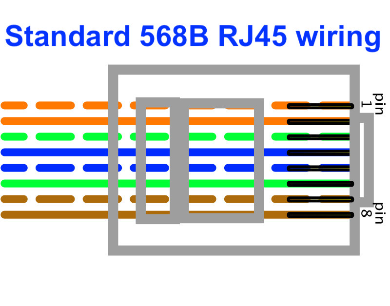
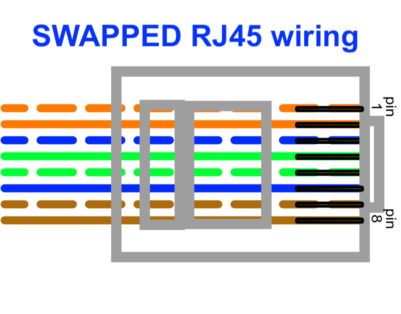
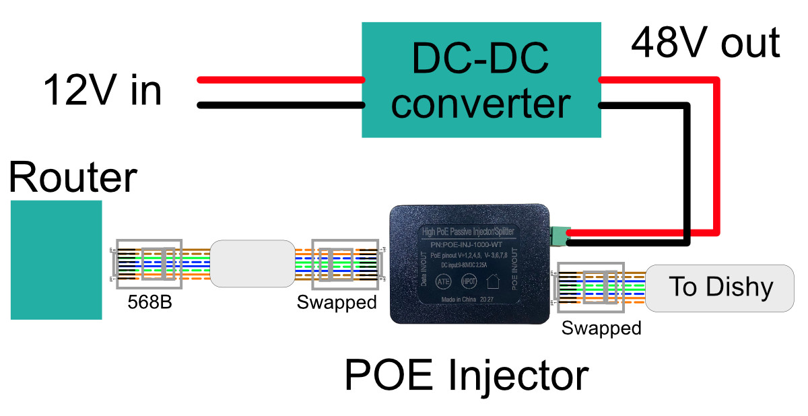

# Replacing the Starlink power supply with a POE injector and aftermarket router

The standard Starlink router and power supply (combined in the case of the [] dish, separate units for the () dish) are
not ideal for use in a mobile application. They require 120-240VAC and are somewhat power hungry. This document details
how to replace
the router and/or power supply with a custom POE injector and an after-market router.

## What you'll need

* A 12-48V DC-DC converter rated at 250W or better.
* Several shielded RJ45 connectors
* A crimp tool for the connectors and the knowledge to use it.
* A POE injector
* An aftermarket router

## Dish cable

The cable supplied with the dish (either () or []) is an outdoor rated Cat5e ethernet cable. Any other ethernet cable
you use (e.g. from the POE injector to the router) should be shielded Cat5e or Cat6.

## Connectors

At the dish end there
is a proprietary connector, so it's impractical to do anything with this end. The () dish has a standard shielded RJ45
connector on the other end of the cable that plugs into the Starlink-supplied power supply, but
unless you retain the Starlink power supply or acquire a special Starlink-compatible POE injector you won't be able to
use this, and in any case you will probably want to shorten the cable. The cable can be cut and
re-terminated with standard RJ45 shielded connectors - the color coding used by Starlink is standard for data (T568B)
but see below about power.

The [] dish cable has a proprietary connector at the router end and therefore must be replaced with an RJ45 to use a different
power supply irrespective of which POE injector you use.

## RJ45 wiring

The standard (or at least the most common standard and the one used by Starlink) wiring convention for RJ45 ethernet
cables is known as _T568B_ (or just 568B) and looks like this - viewed from the flat
side of the connector, i.e. opposite the spring latch:

## Connector crimping

To attach an RJ45 connector to the cable you need a suitable crimp tool. If you aren't familiar with the process either
find
someone who is or watch one of the many YouTube videos that explain how to do it.

## Shielding

The dish cable is a _shielded_ ethernet cable - this means it has an outer shield to protect from static electricity.
The shield includes a bare wire inside the cable which must be connected to the metal shell of the RJ45 connector - fold
the bare wire between two of the other wires and back out of the connector so that when it is crimped the wire contacts
the metal shield.

## Supplying power

Dishy is powered by POE (Power over Ethernet) at 48-56V, but with non-standard pin connections.
To replace the Starlink power supply, I used a passive POE injector
and a 12->48V DC-DC converter, allowing me to run the dish from 12V.

## POE Injector and pinout

Power Over Ethernet supplies power over the same wires as are used for data and normally will provide +48V on pins 1,2,4
and 5 (the orange and blue pairs) with the return on the remaining pairs. Starlink for unexplained reasons chose to use
pins 1,2,3, and 6 (the orange and green pairs) for the positive voltage instead. The voltage can be anywhere between 48
and 56V (with a short cable the lower voltage will be fine.)

Since off-the-shelf POE injectors are all wired to use the standard wires (1245), you either need a special
Starlink-specific injector
or to perform some trickery with the wiring. One possible source for a Starlink-specific POE injector is
[Dishypowa.com](https://dishypowa.com/) but at the time of writing they were not yet shipping. If you use one of these
the cable can be terminated with an RJ45
shielded connector using standard 568B wiring, and you can ignore all references that follow to "swapped" wiring.

If you want to use a generic POE injector like the
[Tycon POE-INJ-1000-WT](https://www.tyconsystems.com/poe-inj-1000-wt) then you will need to wire the RJ45 connector
on the end of the Dishy cable (and on one end of the patch cable from the injector to your router) in a non-standard
way.
By swapping the blue and green pairs on *both* sides of
the injector the power ends up in the right place but the end-to-end mapping of cable pairs is unchanged.

The _swapped_ wiring diagram for an RJ45 connector looks like this - as you can see it is the same as the 568B wiring
but with the blue and green pairs swapped.

So the cable from the dish should be cut to the required length, and an RJ45 connector attached using _SWAPPED_ wiring.
Then make a patch cable to go from the POE injector to the router with one end SWAPPED and the other end standard 568B.

The entire wiring diagram then looks like this:

## DC-DC converter

To provide the required 48VDC to the dish, you will need a 12-48V
DC-DC converter. The dish requires up to 120W during boot (and when in snow-melt mode) but you should over-size the
DC-DC converter - the cheaper units tend to over-state their capabilities, and you need the power supply to be able to
handle short current peaks. I would recommend a minimum rating of 250W. I used
[this unit](https://www.amazon.com.au/gp/product/B09HV9GLMB)
which is seriously over-sized for the job, and also requires a mounting case (3d model for that in this repository.)
Others have reported
success with
a [384W uxcell converter](https://www.amazon.com.au/uxcell-Big-Size-Waterproof-Converter-Regulator/dp/B01LYVSL53)
which would make mounting easier.

If your DC-DC converter is adjustable (like the unit I used) you can set the
output voltage a little higher than 48V, e.g. 52V, which will
reduce the current slightly and ensure a solid 48V at the dish end
after voltage drop in the cables. Do not exceed 56V.

## 12V supply

Your 12V supply to the DC-DC converter should be rated for at least 15A (it will not draw that much continuously) so use
appropriate size wiring, and a suitable fuse or circuit breaker as close to the power source as possible (this is to
protect the wires, not the DC-DC converter.)

## Router

The standard Starlink router is not able to run from 12V, and uses
a fair bit of power, and has very few features (no VPN support, no guest network etc.) I used
a [Gl.inet Slate router](https://www.amazon.com.au/GL-iNet-GL-AR750S-Ext-Gigabit-pre-Installed-Included/dp/B07GBXMBQF)
which runs from 5V (so requires a 12v-5V converter), uses very little power and is based on OpenWRT making it very
flexible. It has been working fine for me. Any other router that can run from 12V and has the features you need should
work - the interface to Dishy is standard DHCP which is the default configuration for most routers.

## Router configuration

To set up the router you need to either have prior networking experience or be able to read the router manual. The main
thing you need to know is that the patch cable from the POE injector should be plugged into the router's WAN port, and
the router should be configured to expect a DHCP address from the dish.

## 4G backup

Although Starlink works almost everywhere, there are occasions where due to e.g. tree cover, some backup is useful. I
plugged a
Huawei E8372 USB 4G modem into the router for this purpose (with its internal Wi-Fi turned off.) The Slate router can
also act as a repeater from another Wi-Fi network. The E8372 does not fit into the Slate router USB socket due to its
size, so I used a short USB extension cable and mounted it with a 3D printed bracket - files for that are in this
repository.

## Power consumption

The () dish seems to average around 30-35W power drain (including losses in the DC-DC converter) - I have heard the []
uses slightly less. The Slate router uses about 6W.

