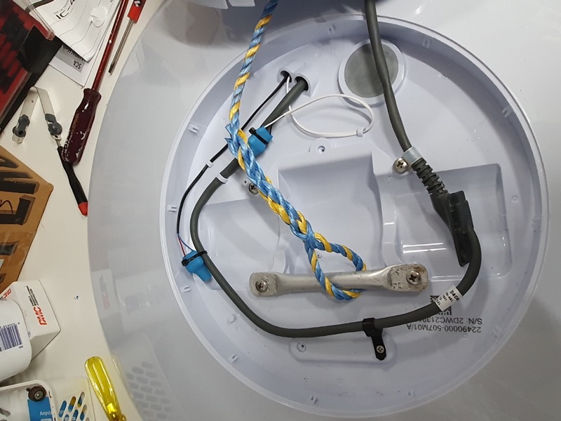
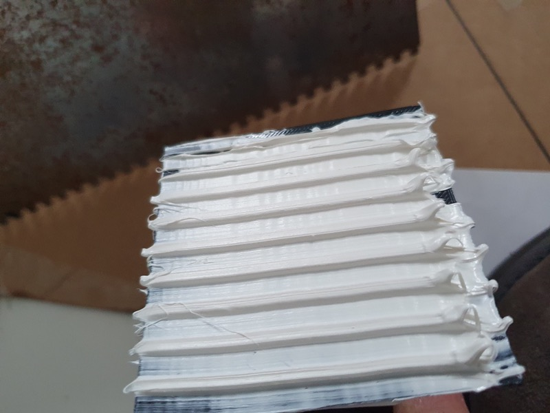
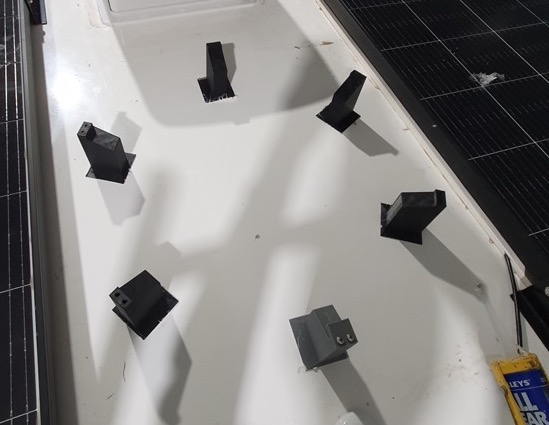

# Mounting a round Starlink Dishy to an RV in a fixed position

## TL;DR

* Remove the pole and motor from your round Dishy
* 3D print 6 mounting blocks and a case closure
* Glue to the top of your RV
* Supply POE
* Enjoy Starlink anywhere with no setup.

## Why and What

Now that Starlink has an RV plan that allows roaming anywhere within their service area, use on an RV has become very
appealing. The standard Starlink dishes mount on a pole, and have inbuilt motors that point the dish in the most
favourable direction for the given location. This is inconvenient for RV use since it either requires demounting the
dish and storing it for travel, or some very clever arrangements. Also, while the pole is supposed to handle high winds,
it's not intended for use on top of a moving vehicle, even when the dish is not in use.

This repository documents the solution I adopted to this problem. Some important caveats:

1. This is a record of what I did and how I did it. It is not intended to be a "how-to", just a resource for use by
   those who might want to attempt something similar. I take no responsibility for anything anyone else might do with
   the information.
2. Starlink does not currently support use in motion and their terms of service state that doing so will void your
   warranty.
3. Modifying your dish will void your warranty.
4. Mounting anything on top of a vehicle should be done with great care - you do NOT want it to come off while
   travelling.
5. There are other risks that you should consider in doing anything non-standard with a Starlink dish.

## Background

I won't explain the Starlink system here - there are plenty of other resources for that. But a brief explanation of dish
pointing is in order.

The Starlink satellites communicate with the user terminal ("Dishy") at very high frequencies (17-40GHz) which allows
very tight beam formation. The dish has a phased array antenna that can electronically point in any direction within a
cone of about 90 degrees. For various reasons the dish will use its motors to point towards the nearest pole (so north
in the northern hemisphere) with an elevation (angle above the horizon) of 60 degrees or so (at high latitudes it may
point straight up or even toward the equator.) However, once this position is established the dish does not move, and
tracking of the satellites (which pass across the entire field of view in about 2 minutes) is entirely achieved by
electronically steering the beam using the phased array antenna.

The dish also incorporates an accelerometer and gyroscope that enables it to stabilise the beam if the dish is moving (
which is why Starlink says it is ok to be mounted on a tall pole or even in a tree.)

So, if the dish is unable to move itself it will still work. There may be some performance drawbacks (e.g. inability to
track a satellite at a low elevation) but the system is sufficiently fault-tolerant that it's not a big deal.

## Round vs rectangular dish

The Starlink dishes to date have come in three revisions;

1. Rev 1 was the first batch of round dishes, with black parts. These have higher power consumption and are possibly
   less reliable. You don't want one of those.
2. Rev 2 was the second batch of round dishes, distinguishable from Rev 1 by grey rather than black parts. They are not
   now available from Starlink but can be bought on the second hand market. I'll refer to this by the symbol ().
3. Rev 3 which is what is currently shipping is the rectangular dish, and will be referred to as [].

## Getting a dish

If you order a dish now from Starlink it will be a [], but () dishes are sometimes available second-hand - make sure if
you buy one of these that the seller will transfer their account to you. You can enable mobility either with the RV plan or by adding "Portability" to the residential plan which allows use of the dish anywhere in the service area (on the
same continent) for an extra cost. Starlink's plan offerings change fairly frequently so see their [support page](https://support.starlink.com/) for up-to-date information.

## Removing the pole and motors

I used a () dish from which removing the pole and motors is relatively easy since it's possible to disassemble the dish
without destroying anything. The [] dish though is glued together and to remove the pole and motors requires cutting
into it. I will not detail this here (I haven't done it) but there is plenty of information on the net about it.

## Deconstructing ()

To remove the pole and motors from the () start by placing the dish face down on a table. The pole goes into an opening
in a pop-in piece on the back of the dish. Use a couple of small screwdrivers to prise this cover piece off.

There is a plastic cover over the motors held on by small screws - remove these screws and loosen the cover. There are 4
larger screws holding the motor assembly onto the dish - loosen these screws but don't take them all the way out yet.

There are two cables plugged into the motors - unplug these.

Stand the dish up on one edge and insert a sturdy spudger or putty knife into the gap between the front and back of the
dish. Lever the back of the dish away from the front - you may need to try a couple of different locations - and you wil
be rewarded by a pop and the gap will open up. Move along a bit and repeat until the all the clips are free.

Now remove the motor screws completely. There are still two cables (motor and ethernet) connecting the two dish halves
so don't separate them too far.

Examine around the edge of the dish inside and find the plugs that connect the ethernet cable and motor cable -
disconnect the ethernet cable only. It has a latch that needs to be depressed to pull it out. The cable goes into the
motor compartment through a grommet - ease this out. Now you can pull the cable out of the dish and remove the motors
and pole completely. The cable comes out of the pole by sliding the moulded fitting out of the pole then threading the
cable out through the motor shaft and pole.

Now re-insert the cable into the dish and plug back in, and re-establish the grommet.

Close the dish back up - position the clips in the right place and press the two halves together so all the clips are
re-secured.

Now secure the cable inside the motor housing (I used a couple of cable clamps.) Replace the motor screws with shorter
M6 screws (30mm IIRC) - these serve to hold the two dish halves together.

At this point I added a tether to the dish by securing an aluminium tube between two of the motor screws with an
attached polypropylene rope with an eye splice. This, if secured to a sturdy point on the RV roof, provides a backup in
case the mounting blocks fail - the dish might bang around on the roof but won't fly off. This is probably unnecessary,
but it gave me peace of mind.

The inside of the motor compartment looks like this now:

The motor cables have shrink-wrap to protect the connectors and are secured.

Thread the cable and tether through the hole in the motor compartment cover and pop it back into place.

## Closing the gap

I closed up the opening in the motor compartment cover with a 3D printed snap-in closure.

When everything was completed I sealed around the edge of this with some silicone sealant. The drain hole is left open.

## Mounting

Obviously you need enough space on your roof for the dish. The () is about 600mm diameter. I 3d printed 6 mounting
blocks:

Each block has a flat base which is glued to the RV roof, and a top clamp that secures the edge of the dish with 2 M6x30
screws.

Create a mounting template by drawing a hexagon on a large piece of cardboard, extend lines out to position the blocks,
secure with sticky tape and place the dish on. Adjust the position of the blocks to form a neat fit, then remove the
dish. With the blocks still taped in place, cut around the bases to end up with 6 holes.

Now tape the template onto your roof:

I used Sikaflex 252 sealant to adhere the blocks to the roof, with Sika Primer-215. With the primer, the Sikaflex 252 is
permanent - you cannot remove it! As such it forms a very secure bond. Prime through the holes in the template, prime
the bottoms of the mounting blocks. When dry, apply Sikaflex to the mounting block with a tiling trowel and press firmly
into the template hole.

When dry (allow 24 hours) I removed the cardboard template.

Next I applied a blob of silicone sealant to the sloped surface of each block and dropped the dish
in. The clamping blocks are secured with two M6x30 screws - I used some superglue on the screw threads since the formed
threads in the printed block are not fantastic. They should still be removable, as will the silicone.

Run the cable to where you want it. I used flat electrical ducting (the kind with a removable cover.)

For information on how to power the dish via POE see [this README.](/poe/README.md)
