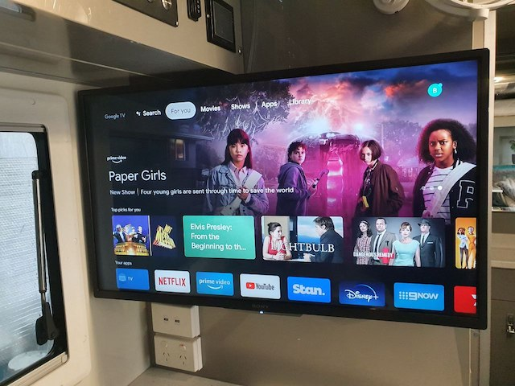
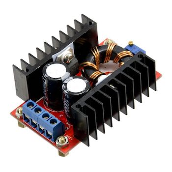
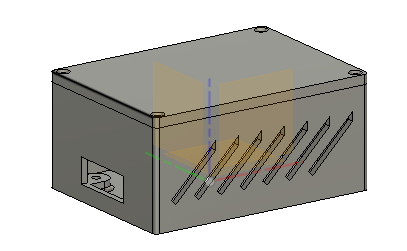
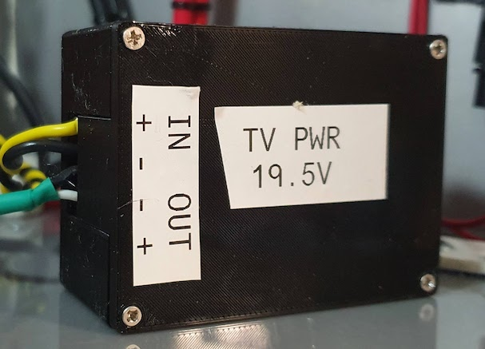

# Powering a Sony TV from 12V

## Why?

If you want a TV that will operate from 12V for use in an RV or other off-grid situation, there is a very
limited choice of units, all of which are niche brands, expensive and lacking in features. My RV came with
an RVMedia 32" TV advertised as having "smart TV" functionality, but it runs an old version of Android, is
very slow on bootup and loading apps, won't run all the expected apps properly, and has a terrible user interface.

I went searching for an alternative and found a very limited choice of 12V TVs. I then started looking at name-brand
TVs (specifically Samsung, LG and Sony) which typically have very good user interfaces and a wide range of functional
apps. However, none of these manufacturers appear to (now) offer any units that directly run from 12V. Most have an
inbuilt AC power supply which would be difficult to modify for 12V operation.

However, the smaller Sony TVs use an external power supply with the TV itself having a DC input operating at 19.5V.
So I bought a Sony W830K, discarded the accompanying external power supply, and installed a DC-DC converter to
up-convert 12V to 19.5V. This works perfectly. The TV has VESA mounting points on the back making it easy to attach to a
standard mounting bracket.

Obviously you could power the TV using the standard power supply from an inverter, but this uses more energy due to
double conversion - going straight from 12V to 19.5V is more efficient.

## Parts needed

* A Sony TV with an external DC power supply
* A DC-DC converter capable of converting 12V to 19.5V at 3A or more.

It is possible to buy laptop power supplies that run from 12V and deliver 19.5V (either 19 or 20V is likely to work
fine) and may come with a suitable connector that will plug into the TV, but I
used [this unit](https://core-electronics.com.au/150w-dc-dc-boost-converter-10-32v-to-12-35v-6a.html) from
Core Electronics which is very cheap, and can be adjusted to deliver the correct voltage. It's rated at 6A output
which is more than enough for the job. I cut the cable with plug off the Sony AC power supply and wired it to the DC
output.

The converter could be just mounted to a panel, but I preferred to enclose it, so 3D printed a case.
The files for this are included here:

* [Fusion 360 design file](DCDC%20housing.f3d)
* [Printable base](dcdc%20housing%20base.3mf)
* [Printable lid](dcdc%20housing%20lid.3mf)

The case is about 70x40x50mm.

The DC-DC supply should be supplied with 12V via a suitable circuit breaker (e.g. 10A). Keep the cables short and make
sure the wire gauge especially on the 12V side is adequate for up to 10A.

